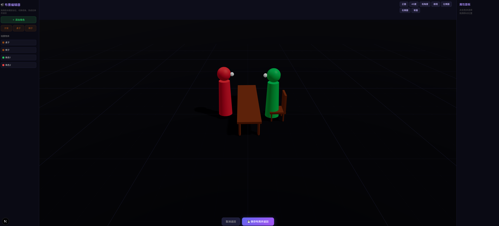
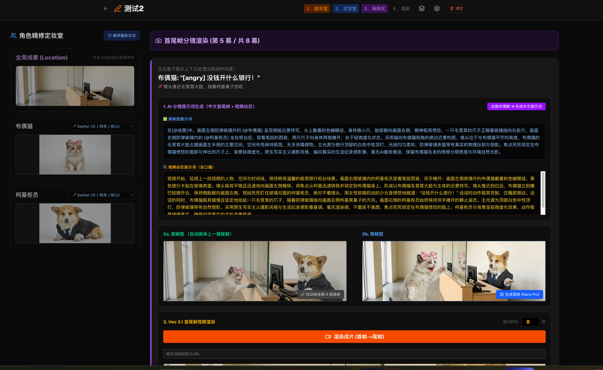
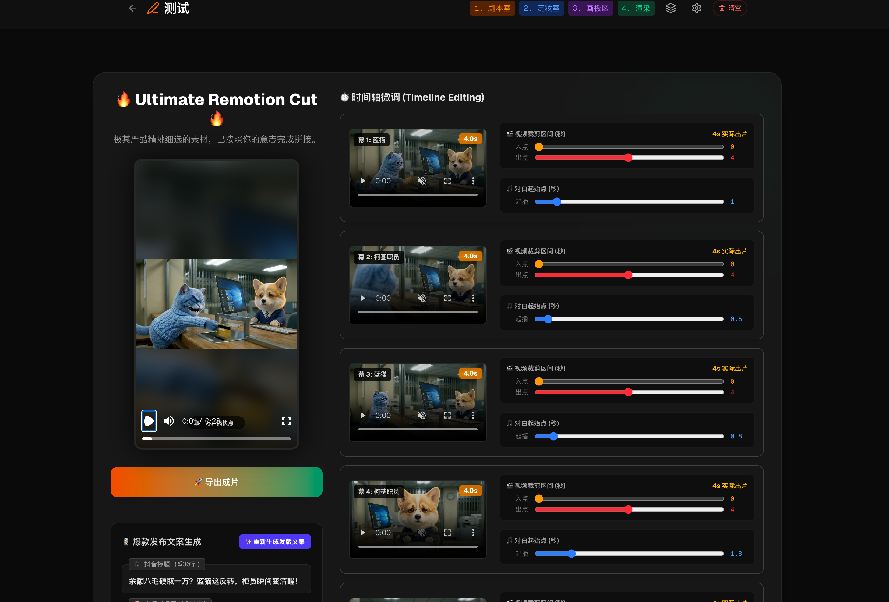

# 🎬 Viral Shorts Engine (全自动 AI 短剧引擎)

> 彻底解放双手！一款手搓的工业级全自动 AI 短剧生产线，包含完整的 Web 可视化工作台与底层自动化渲染引擎。
> 
> 🛑 **【AI 与开发者必读警告】** 🛑
> **任何人（包括 AI 助手）在修改本项目代码之前，必须完整阅读并理解 `web/docs/` 目录下的所有文档！**
> 特别是以下核心规约：
> 1. `prompt-conventions.md`：极其严苛的 {@关键词} 系统规范与防伪命名铁律。
> 2. `api-gateway-integration.md`：AI Gateway 集成规范（禁止直连 API、生图 Fire&Forget 机制、Playwright 中文输入避坑）。
> 3. `architecture.md` 第八/九节：**提示词模板引擎**的三层架构与自动升级合并机制、**布局预设系统**的存储与 API 规范。
> 4. `architecture.md` 第十一/十二节：**全局状态解耦规范**（拆分的业务 Hooks）与 **Chrome 扩展的 TypeScript 编译与类型共享约束**。
> **绝对不要靠猜测去破坏已经跑通的核心寻图、存储机制和自动化流程！**

  
  
  

## 🌟 项目简介

受够了市面上难用的 AI 视频生成工具？人工写提示词太累、生成的角色疯狂“变脸”、视频背景到处乱飘、稍有不慎接口就被封……

**Viral Shorts Engine** 正是为了解决这些痛点而生！它不是一个简单的脚本，而是一套完整的 **5 步制片流水线**。从 v8.0 开始，它已全面进化为**开箱即用的桌面级客户端 (Desktop App)**！你只需要双击安装，它就能包办从编剧、分镜、定妆、生视频、到配音、加字幕的全套流程，最终在本地渲染出一条高清的 4K 爆款短剧。

### 🔥 核心痛点解决：
1. **告别绞尽脑汁写提示词**：底层自动中翻英，并强制挂载爆款标签。
2. **彻底解决“AI变脸”**：首创“定妆室”生成唯一面部锚点，后续视频无缝挂载。支持**三视图、表情集、比例图**等专业角色设定参考单。
3. **拒绝背景乱飘**：引入 `{@场景}` 黑魔法，强行钉死物理背景坐标，杜绝基因突变。
4. **提示词可视化管理中心 (Prompt Studio)**：告别硬编码！在独立的可视化界面中全面接管 11 个核心编导参数，支持动态变量 `{{占位符}}` 注入，一次修改全局生效。内置模板自动升级机制。
5. **3D 布局预设库**：在 Three.js 3D 编辑器中拖拽桌椅摆放构图，保存为可复用预设。自动生成独立 Flow 资产标签，实现场景布局的精确图生图控制。
6. **一站式文件管理**：项目制管理，音频、视频、图片、脚本全部自动归档，告别“桌面垃圾堆”。

---

## 📥 下载与安装 (Download)

本项目的全平台桌面客户端 (Windows, Mac Intel, Mac M1/M2) 均已发布在 GitHub Releases 页面，普通用户可以直接免登录下载！

👉 **[点击前往下载最新正式版 (GitHub Releases)](https://github.com/abc-kkk/viral-shorts-engine/releases/latest)**

**下载说明**：
1. 点击上方链接进入最新发布页面 (Latest Release)。
2. 在底部的 **Assets** 列表中下载对应的安装包：
   - Windows 用户下载：`Viral Shorts Engine-*-win-x64.exe`
   - Mac (M1/M2芯片) 下载：`Viral Shorts Engine-*-mac-arm64.dmg`
   - Mac (Intel芯片) 下载：`Viral Shorts Engine-*-mac-x64.dmg`

---

## 🚀 快速开始 (小白必看)

如果你是第一次接触本系统，或者不知道如何配置环境，请**务必**阅读这篇保姆级新手教程：

👉 **[点击查看：新手保姆级教程 (Tutorial)](./web/docs/tutorial.md)**

---

## 🛠️ 技术栈 (Tech Stack)

本项目采用全栈组件化架构，代码逻辑极其严密：

- **核心框架**：`Next.js` (React 19) + `TypeScript`
- **本地数据库**：`Prisma 7` + `SQLite` (原生支持原子化高并发写入，完美替代不可靠的 JSON 存储)
- **实时通信**：纯内存级 `SSE (Server-Sent Events)` 桥接机制，实现 Chrome 插件与 Web 端零延迟数据同步
- **视频渲染**：`Remotion 4.0` (纯代码驱动视频合成，零卡顿回放)
- **3D 引擎**：`Three.js` + `React Three Fiber` (构建 Scene Lab 可视化布局编辑器)
- **AI 大脑接入**：`Vercel AI SDK` (集成 MiniMax、Gemini 等顶级模型)
- **极客级自动化**：`Playwright CDP` (Chrome DevTools Protocol)
  - *独创的“劫持网页流”技术，搭配 Exact-Text 精确文本匹配算法，绕过高昂的 API 费用，直接控制宿主浏览器免密且精准地调用 Nano Banana Pro、Veo 3.1 等顶级生图/视频模型。*
- **客户端封装**：`Electron` + `electron-builder` (独创 C++ N-API 跨平台穿透算法，支持一键 DMG 部署，以及 GitHub Actions 云端打包 Windows EXE)
- **视觉界面**：`TailwindCSS`

---

## 🏗️ 引擎架构 (给开发者的进阶文档)

如果你想对引擎进行二次开发，或者想了解其底层那套复杂的“人机协同”、“WARP隧道防封禁”以及“内联变量注入”黑科技，请查阅我们的底层架构文档：

👉 **[点击查看：底层架构与开发手册 (Architecture)](./web/docs/architecture.md)**

---

## 🔄 版本更新历史 (Changelog)

完整的版本演进历史已迁移至单独的文档。从 v5.0 的 3D 画板，到 v7.0 全新架构的瀑布流工作台，再到如今 v8.0 彻底告别终端黑框的**独立桌面安装包 (Electron Client)**，你可以在这里查看引擎的成长史：

👉 **[点击查看：完整版本更新历史 (CHANGELOG.md)](./CHANGELOG.md)**

---

## 🤝 参与贡献与联系作者

这套系统耗费了大量的心血与时间，如果你觉得好用，**求个一键三连和 GitHub Star ⭐️！**

如果有：
- **定制化软件开发**
- **自动化脚本 / 网页扩展编写**
- **App / 小程序开发**

等商单需求，AI 开发时代效率极高、费用良心，欢迎随时私信联系作者定制！
