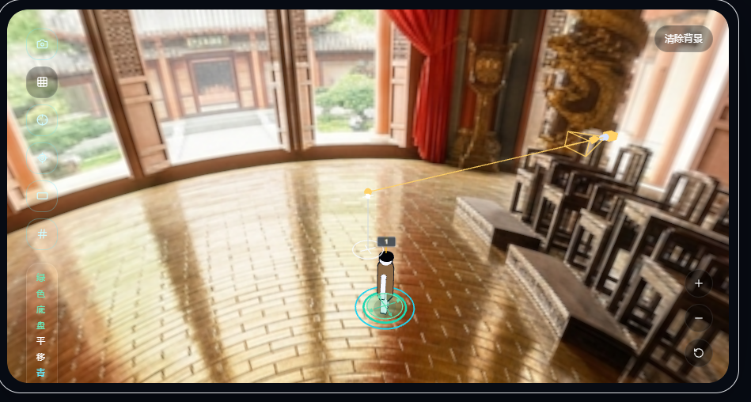
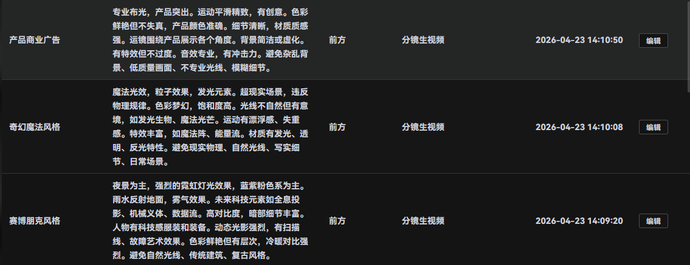

3D布景编辑器里面如果可以把之前生成的场景图直接复制进来然后人物在布局

产品商业广告
专业布光，产品突出。运动平滑精致，有创意。色彩鲜艳但不失真，产品颜色准确。细节清晰，材质质感强。运镜围绕产品展示各个角度。背景简洁或虚化。有特效但不过度。音效专业，有冲击力。避免杂乱背景、低质量画面、不专业光线、模糊细节。

奇幻魔法风格
魔法光效，粒子效果，发光元素。超现实场景，违反物理规律。色彩梦幻，饱和度高。光线不自然但有意境，如发光生物、魔法光芒。运动有漂浮感、失重感。特效丰富，如魔法阵、能量流。材质有发光、透明、反光特性。避免现实物理、自然光线、写实细节、日常场景。

赛博朋克风格
夜景为主，强烈的霓虹灯光效果，蓝紫粉色系为主。雨水反射地面，雾气效果。未来科技元素如全息投影、机械义体、数据流。高对比度，暗部细节丰富。人物有科技感服装和装备。动态光影强烈，有扫描线、故障艺术效果。色彩鲜艳但有层次，冷暖对比强烈。避免自然光线、传统建筑、复古风格。

二次元动画风
鲜明的线条轮廓，平面化着色，高对比度色彩。人物有大眼睛和夸张的表情变化，动作流畅有弹性。背景有动画特有的纹理和细节，如网点、速度线等特效。光线处理简化但有效，阴影明确。色彩饱和度高，色调统一。运镜有动画特有的夸张角度和快速切换。避免写实光影、真实纹理、照片级细节。

仿真人风格
自然光线有明确方向，包含主光、补光和轮廓光，形成真实光影层次。手持摄影机轻微晃动模拟呼吸感，多角度运镜自然过渡。人物有自然微表情和肢体语言，眨眼频率约3-5秒，动作有预备和缓冲。皮肤显示真实纹理和细微瑕疵，衣物有自然褶皱和质感。环境背景适度虚化但有生活细节。色彩为电影胶片色调，低饱和度，略带颗粒感。运动时有动态模糊，光影随时间微妙变化。避免CG感、塑料质感、完美对称、僵硬表情、过度鲜艳色彩、背景过于干净、光线不自然。包含真实细节如碎发、衣物褶皱、环境互动，确保符合物理规律。

超现实奇幻喜剧广告画面
超现实奇幻喜剧广告画面，电影级广告质感，8K 超高清，写实渲染 + 卡通夸张形变，高对比度高饱和色彩，《中华小当家》式夸张美食特效，周星驰无厘头荒诞搞笑，《死侍》式打破第四面墙直视镜头，动态张力拉满，流体粒子特效，体积光，慢镜头质感，夸张表情与肢体反应，视觉冲击强烈，商业大片光影，暗调夜景 + 龙虾红 + 啤酒金 + 灯笼暖橙，细节丰富，质感细腻，氛围热闹狂欢 负面词（通用必加） 低清，模糊，噪点，畸形，扭曲，多余肢体，文字水印，杂乱背景，平淡光影，写实过度，恐怖，阴郁

